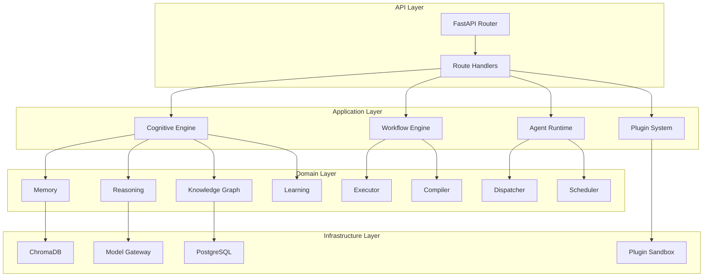
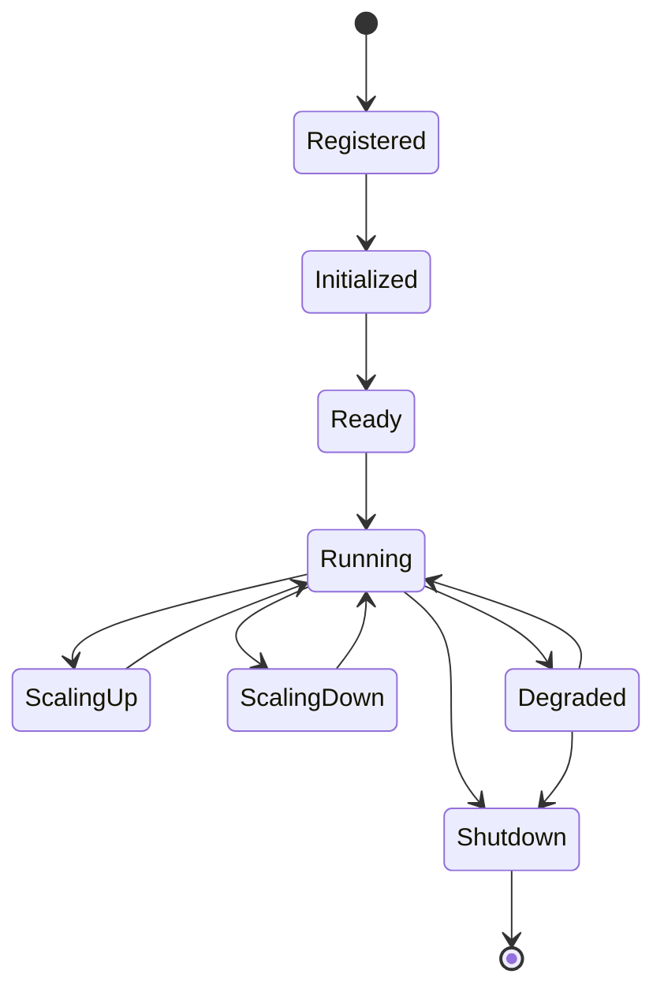
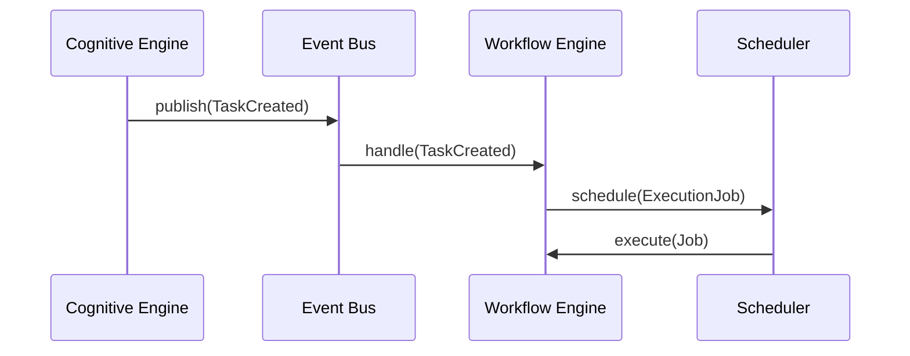
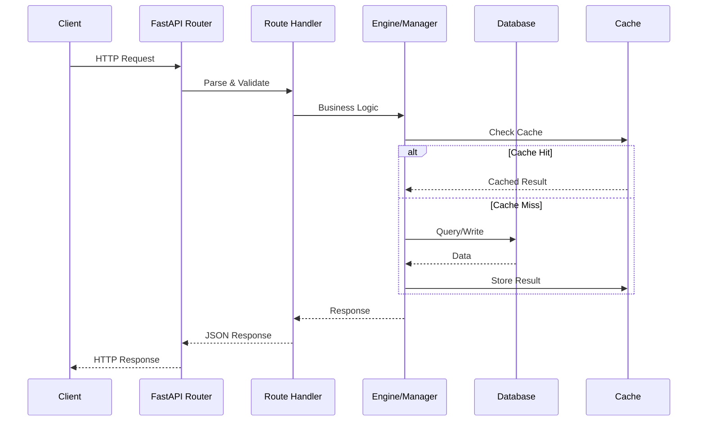

# Architecture

## Package Reference

The application code lives under `app.*` with 35 packages:

| Package | Purpose |
|---------|---------|
| `app.agents` | Multi-agent runtime |
| `app.api` | FastAPI routes and middleware |
| `app.autonomy` | Autonomy engine |
| `app.cognitive` | Cognitive engine |
| `app.core` | Core utilities |
| `app.db` | Database layer |
| `app.deployment` | Deployment management |
| `app.enterprise` | Enterprise features |
| `app.events` | Event system |
| `app.executive` | Executive functions |
| `app.future` | Feature flags and roadmap |
| `app.integration` | Integration layer |
| `app.kernel` | Kernel runtime |
| `app.knowledge_graph` | Knowledge graph |
| `app.learning` | Learning engine |
| `app.long_term_memory` | Long-term memory |
| `app.memory` | Memory management |
| `app.models` | Model gateway |
| `app.nova_os` | NOVA OS layer |
| `app.observability` | Observability stack |
| `app.orchestrator` | Orchestrator |
| `app.performance` | Performance engine |
| `app.planner` | Planner |
| `app.plugins` | Plugin system |
| `app.rag` | RAG pipeline |
| `app.reasoning` | Reasoning engine |
| `app.resilience` | Resilience layer |
| `app.scaling` | Scaling infrastructure |
| `app.scheduler` | Job scheduler |
| `app.schemas` | Shared schemas |
| `app.security` | Security layer |
| `app.services` | Service layer |
| `app.tools` | Tool system |
| `app.vector_memory` | Vector storage |
| `app.workflows` | Workflow engine |

## Design Principles

NOVA CORE follows these engineering principles:

1. **Async-First** — All I/O operations use `async/await` with Python's asyncio
2. **SOLID** — Single Responsibility, Open/Closed, Liskov Substitution, Interface Segregation, Dependency Inversion
3. **Clean Architecture** — Domain logic isolated from infrastructure via ABCs
4. **Strategy Pattern** — Pluggable algorithms behind provider interfaces
5. **Dependency Injection** — Components wired via constructors and registries
6. **Strong Typing** — Full type annotations with `from __future__ import annotations`

## Layer Diagram



## Core Patterns

### Provider Pattern (Strategy)

Every subsystem exposes an ABC in `base.py` and an in-memory implementation:

```python
# ABC defines the contract
class EventBus(ABC):
    @abstractmethod
    async def publish(self, event: Event) -> None: ...

# InMemoryEventBus implements the contract
class InMemoryEventBus(EventBus):
    async def publish(self, event: Event) -> None:
        ...
```

### Factory Pattern

Each subsystem has a `factory.py` with static creation methods:

```python
class EventSystemFactory:
    @staticmethod
    def create_bus() -> EventBus:
        return InMemoryEventBus()
```

### Lifecycle Pattern

Components follow state machines:



### Event-Driven Communication

Subsystems communicate through events:



## Request Lifecycle



## File Conventions

Each subsystem follows a consistent file structure:

| File | Purpose |
|------|---------|
| `__init__.py` | Package exports |
| `base.py` | Abstract base classes (ABCs) |
| `models.py` | Domain dataclasses and enums |
| `schemas.py` | Pydantic request/response models |
| `enums.py` | Enumerations |
| `engine.py` or `manager.py` | Core business logic |
| `factory.py` | Static factory methods |
| `lifecycle.py` | State machine |
| `metrics.py` | Metrics collection |
| `tracing.py` | Distributed tracing |
| `registry.py` | Component registry |
| `api.py` | API-specific logic |
