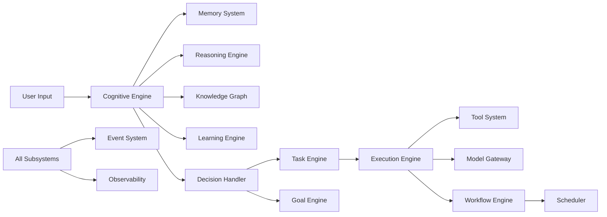

# System Overview

## Subsystems at a Glance

NOVA CORE is composed of 30 interconnected subsystems across 466 Python source files.

### Cognitive Layer

| Component | Package | Description |
|-----------|---------|-------------|
| Cognitive Engine | `app.cognitive` | Core reasoning pipeline with context, decision, and state management |
| Memory | `app.memory`, `app.long_term_memory` | Short-term conversation memory and persistent long-term memory |
| Learning | `app.learning` | Knowledge extraction from interactions and consolidation |
| Knowledge Graph | `app.knowledge_graph` | Entity and relationship management with graph queries |
| Reasoning | `app.reasoning` | Multi-strategy reasoning chains with evaluation and critique |

### Execution Layer

| Component | Package | Description |
|-----------|---------|-------------|
| Goal Engine | Embedded in orchestrator | Goal decomposition, tracking, and analysis |
| Task Engine | Embedded in orchestrator | Task lifecycle with state transitions |
| Planning Engine | `app.planner` | Task planning with strategies and replanning |
| Execution Engine | `app.kernel` | Step-by-step execution with context management |
| Multi-Agent Runtime | `app.agents` | Agent registration, dispatch, coordination |

### Infrastructure Layer

| Component | Package | Description |
|-----------|---------|-------------|
| Tool System | `app.tools` | External tool registration, execution, and permissions |
| Model Gateway | `app.models` | LLM provider abstraction with caching and load balancing |
| RAG & Retrieval | `app.rag` | Document indexing, retrieval, reranking, and context building |
| Vector Memory | `app.vector_memory` | ChromaDB-backed vector storage with similarity search |
| Event System | `app.events` | Pub/sub event bus with middleware, replay, and persistence |
| Scheduler | `app.scheduler` | Cron, interval, and trigger-based job scheduling |
| Workflow Engine | `app.workflows` | Visual workflow compilation, execution, and monitoring |
| Plugin System | `app.plugins` | Hot-loadable plugins with sandbox isolation |

### Platform Layer

| Component | Package | Description |
|-----------|---------|-------------|
| Security | `app.security` | Authentication, RBAC, API keys, audit, encryption |
| Observability | `app.observability` | Metrics, tracing, logging, health, diagnostics |
| API Platform | `app.api` | FastAPI routes with versioning and documentation |
| Database | `app.db` | SQLAlchemy async ORM with repositories |
| Deployment | `app.deployment` | Lifecycle, health checks, environment management |
| Scaling | `app.scaling` | Load balancing, worker pools, autoscaling, caching |
| Testing | `tests.backend` | Test infrastructure with fixtures, factories, mocks |
| Future Roadmap | `app.future` | Feature flags, experiments, compatibility, versioning |

## Data Flow

## Technology Stack

| Technology | Version | Purpose |
|------------|---------|---------|
| Python | 3.13+ | Runtime |
| FastAPI | 0.115.0 | HTTP framework |
| SQLAlchemy | 2.0.35 | ORM (async) |
| asyncpg | 0.29.0 | PostgreSQL driver |
| Alembic | 1.13.3 | Database migrations |
| ChromaDB | 0.5.23 | Vector storage |
| Redis | 5.0.8 | Caching and pub/sub |
| httpx | 0.27.2 | Async HTTP client |
| Pydantic | 2.x | Data validation |
| uvicorn | 0.30.6 | ASGI server |
